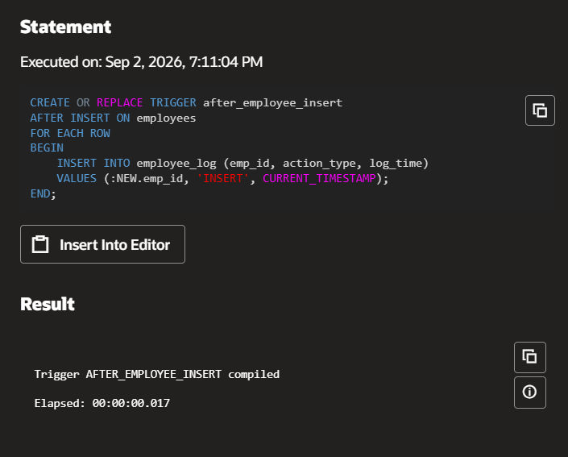
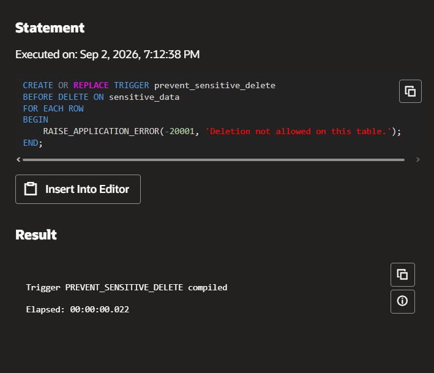
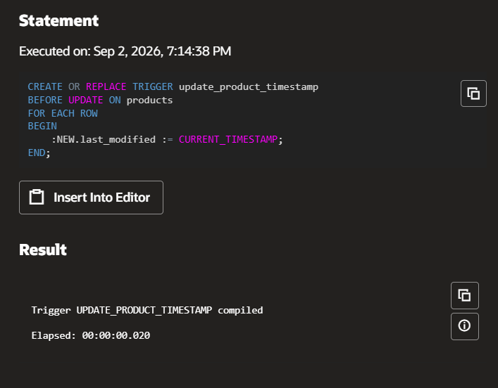
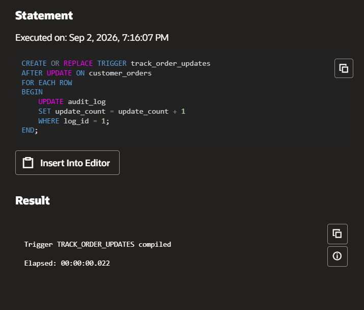
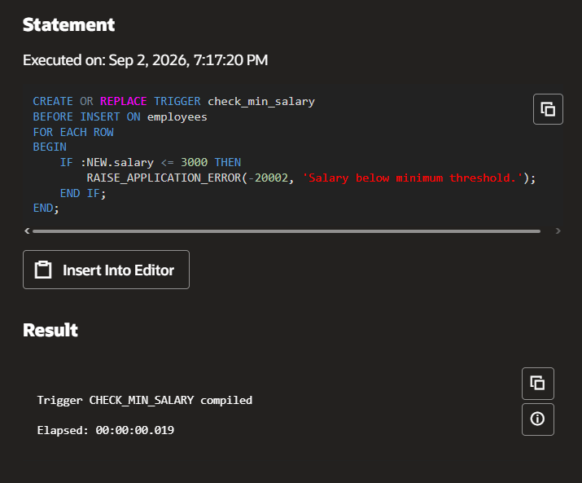

# Experiment 10: PL/SQL – Triggers

## AIM
To write and execute PL/SQL trigger programs for automating actions in response to specific table events like INSERT, UPDATE, or DELETE.

## THEORY
A trigger is a stored PL/SQL block that is automatically executed or fired when a specified event occurs on a table or view. Triggers can be used for enforcing business rules, auditing changes, or automatic updates.
Types of Triggers:
Before Trigger
Executes before the operation (INSERT, UPDATE, DELETE).
After Trigger
Executes after the operation.
Row-level Trigger
Executes for each affected row.
Statement-level Trigger
Executes once for the triggering statement.
Basic Syntax:
```sql
CREATE OR REPLACE TRIGGER trigger_name
BEFORE|AFTER INSERT|UPDATE|DELETE ON table_name
[FOR EACH ROW]
BEGIN
-- trigger logic
END;
```

---

## 1. Write a trigger to log every insertion into a table.
**Steps:**
Create two tables: employees (for storing data) and employee_log (for logging the inserts). Write an AFTER INSERT trigger on the employees table to log the new data into the employee_log table.

### Code
```sql
CREATE TABLE employees (
emp_id NUMBER GENERATED ALWAYS AS IDENTITY PRIMARY KEY,
emp_name VARCHAR2(100),
department VARCHAR2(50),
salary NUMBER(10, 2)
);
CREATE TABLE employee_log (
log_id NUMBER GENERATED ALWAYS AS IDENTITY PRIMARY KEY,
emp_id NUMBER,
action_type VARCHAR2(50) DEFAULT 'INSERT',
log_time TIMESTAMP DEFAULT CURRENT_TIMESTAMP
);
CREATE OR REPLACE TRIGGER after_employee_insert
AFTER INSERT ON employees
FOR EACH ROW
BEGIN
INSERT INTO employee_log (emp_id, action_type, log_time)
VALUES (:NEW.emp_id, 'INSERT', CURRENT_TIMESTAMP);
END;
/
```
### Output


---

## 2. Write a trigger to prevent deletion of records from a sensitive table.
**Steps:**
Write a BEFORE DELETE trigger on the sensitive_data table. Use RAISE_APPLICATION_ERROR to prevent deletion and issue a custom error message.

### Code
```sql
CREATE TABLE sensitive_data (
id NUMBER GENERATED ALWAYS AS IDENTITY PRIMARY KEY,
info VARCHAR2(100)
);
CREATE OR REPLACE TRIGGER prevent_sensitive_delete
BEFORE DELETE ON sensitive_data
FOR EACH ROW
BEGIN
RAISE_APPLICATION_ERROR(-20001, 'Deletion not allowed on this table.');
END;
/
```
### Output


---

## 3. Write a trigger to automatically update a last_modified timestamp.
**Steps:**
Add a last_modified column to the products table. Write a BEFORE UPDATE trigger on the products table to set the last_modified column to the current timestamp whenever an update occurs.

### Code
```sql
CREATE TABLE products (
product_id NUMBER GENERATED ALWAYS AS IDENTITY PRIMARY KEY,
product_name VARCHAR2(100),
price NUMBER(10, 2),
last_modified TIMESTAMP DEFAULT CURRENT_TIMESTAMP
);
CREATE OR REPLACE TRIGGER update_product_timestamp
BEFORE UPDATE ON products
FOR EACH ROW
BEGIN
:NEW.last_modified := CURRENT_TIMESTAMP;
END;
/
```
### Output


---

## 4. Write a trigger to keep track of the number of updates made to a table.
**Steps:**
Create an audit_log table with a counter column. Write an AFTER UPDATE trigger on the customer_orders table to increment the counter in the audit_log table every time a record is updated.

### Code
```sql
CREATE TABLE customer_orders (
order_id NUMBER GENERATED ALWAYS AS IDENTITY PRIMARY KEY,
customer_name VARCHAR2(100),
order_status VARCHAR2(50)
);
CREATE TABLE audit_log (
log_id NUMBER PRIMARY KEY,
update_count NUMBER DEFAULT 0
);
INSERT INTO audit_log (log_id, update_count) VALUES (1, 0);
CREATE OR REPLACE TRIGGER track_order_updates
AFTER UPDATE ON customer_orders
FOR EACH ROW
BEGIN
UPDATE audit_log
SET update_count = update_count + 1
WHERE log_id = 1;
END;
/
```
### Output


---

## 5. Write a trigger that checks a condition before allowing insertion into a table.
**Steps:**
Write a BEFORE INSERT trigger on the employees table to check if the inserted salary meets a specific condition (salary must be greater than 3000). If the condition is not met, raise an error to prevent the insert.

### Code
```sql
CREATE TABLE employees (
emp_id NUMBER GENERATED ALWAYS AS IDENTITY PRIMARY KEY,
emp_name VARCHAR2(100),
salary NUMBER(10, 2)
);
CREATE OR REPLACE TRIGGER check_min_salary
BEFORE INSERT ON employees
FOR EACH ROW
BEGIN
IF :NEW.salary <= 3000 THEN
RAISE_APPLICATION_ERROR(-20002, 'Salary below minimum threshold.');
END IF;
END;
/
```
### Output


---

## RESULT
Thus, the PL/SQL trigger programs were written, compiled, and executed successfully. The required concepts of BEFORE and AFTER triggers, row-level triggers, auditing, automatic timestamp updates, deletion prevention, update tracking, and conditional insertion were implemented with the supplied execution outputs.
