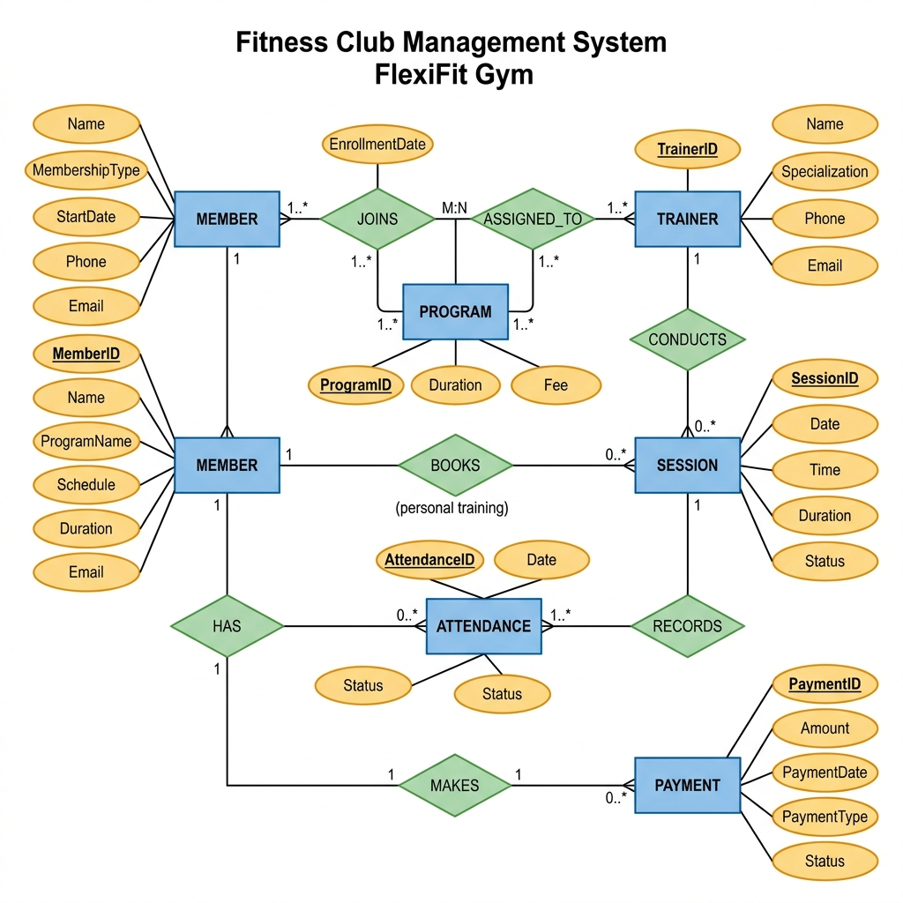
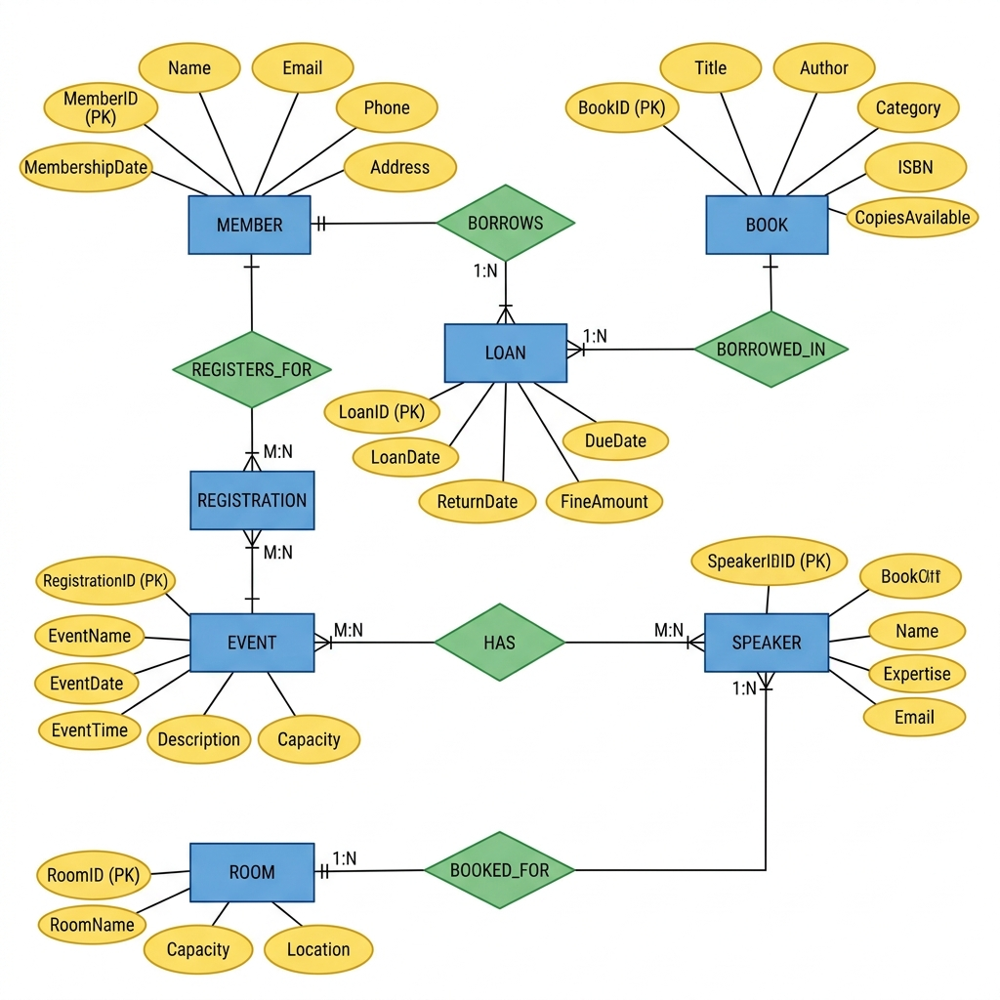
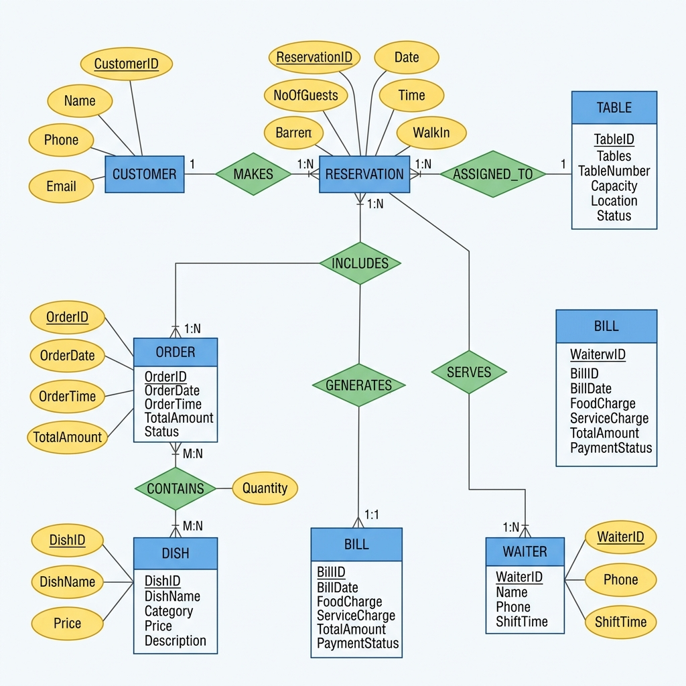

# ER Diagram Workshop – Submission Template

## Objective
To understand and apply ER modeling concepts by creating ER diagrams for real-world applications.

## Purpose
Gain hands-on experience in designing ER diagrams that represent database structure including entities, relationships, attributes, and constraints.

---

# Scenario A: City Fitness Club Management

**Business Context:**  
FlexiFit Gym wants a database to manage its members, trainers, and fitness programs.

**Requirements:**  
- Members register with name, membership type, and start date.  
- Each member can join multiple programs (Yoga, Zumba, Weight Training).  
- Trainers assigned to programs; a program may have multiple trainers.  
- Members may book personal training sessions with trainers.  
- Attendance recorded for each session.  
- Payments tracked for memberships and sessions.

### ER Diagram: 

### Entities and Attributes

| Entity | Attributes (PK, FK) | Notes |
|--------|---------------------|-------|
| MEMBER | MemberID (PK), Name, MembershipType, StartDate, Phone, Email | Stores all registered gym members |
| TRAINER | TrainerID (PK), Name, Specialization, Phone, Email | Certified trainers employed by the gym |
| PROGRAM | ProgramID (PK), ProgramName, Schedule, Duration, Fee | Fitness programs like Yoga, Zumba, Weight Training |
| SESSION | SessionID (PK), Date, Time, Duration, Status, MemberID (FK), TrainerID (FK) | Personal training sessions booked by members |
| ATTENDANCE | AttendanceID (PK), Date, Status, MemberID (FK), SessionID (FK) | Records member presence in each session |
| PAYMENT | PaymentID (PK), Amount, PaymentDate, PaymentType, Status, MemberID (FK) | Tracks membership and session fee payments |

### Relationships and Constraints

| Relationship | Cardinality | Participation | Notes |
|--------------|-------------|---------------|-------|
| MEMBER – JOINS – PROGRAM | M:N | Partial (Member), Partial (Program) | A member can enroll in many programs; each program can have many members. Resolved via ENROLLMENT table with EnrollmentDate. |
| TRAINER – ASSIGNED_TO – PROGRAM | M:N | Partial (Trainer), Total (Program) | A program must have at least one trainer; a trainer can be assigned to many programs. |
| MEMBER – BOOKS – SESSION | 1:N | Partial (Member), Total (Session) | A member can book multiple personal training sessions; each session belongs to one member. |
| TRAINER – CONDUCTS – SESSION | 1:N | Partial (Trainer), Total (Session) | Each session is conducted by exactly one trainer; a trainer can conduct many sessions. |
| MEMBER – HAS – ATTENDANCE | 1:N | Partial (Member), Total (Attendance) | Attendance is always linked to a member. |
| SESSION – RECORDS – ATTENDANCE | 1:N | Total (Session), Total (Attendance) | Every attendance record maps to exactly one session. |
| MEMBER – MAKES – PAYMENT | 1:N | Partial (Member), Total (Payment) | Each payment is linked to one member; a member may make multiple payments. |

### Assumptions
- One membership type is assigned per member at the time of registration; upgrades create a new payment record.
- A program must have at least one trainer assigned before it is made available to members.
- Personal training sessions are optional and billed separately from the standard program fee.
- Attendance is recorded only for sessions that actually take place (not cancelled ones).
- Payment covers both membership subscription fees and personal training session charges.
- A member can enroll in multiple programs simultaneously.

---

# Scenario B: City Library Event & Book Lending System

**Business Context:**  
The Central Library wants to manage book lending and cultural events.

**Requirements:**  
- Members borrow books, with loan and return dates tracked.  
- Each book has title, author, and category.  
- Library organizes events; members can register.  
- Each event has one or more speakers/authors.  
- Rooms are booked for events and study.  
- Overdue fines apply for late returns.

### ER Diagram:

### Entities and Attributes

| Entity | Attributes (PK, FK) | Notes |
|--------|---------------------|-------|
| MEMBER | MemberID (PK), Name, Email, Phone, MembershipDate, Address | Library card holders who can borrow books and attend events |
| BOOK | BookID (PK), Title, Author, Category, ISBN, CopiesAvailable | Physical books in the library collection |
| LOAN | LoanID (PK), LoanDate, DueDate, ReturnDate, FineAmount, MemberID (FK), BookID (FK) | Represents a single borrowing transaction |
| EVENT | EventID (PK), EventName, EventDate, EventTime, Description, Capacity, RoomID (FK) | Cultural or educational events organised by the library |
| SPEAKER | SpeakerID (PK), Name, Expertise, Email | Authors or subject-matter experts invited to events |
| ROOM | RoomID (PK), RoomName, Capacity, Location | Physical rooms used for events and study sessions |
| REGISTRATION | RegistrationID (PK), RegistrationDate, Status, MemberID (FK), EventID (FK) | Tracks member sign-up for events |

### Relationships and Constraints

| Relationship | Cardinality | Participation | Notes |
|--------------|-------------|---------------|-------|
| MEMBER – BORROWS – BOOK | M:N | Partial (Member), Partial (Book) | Resolved via LOAN entity. A member can borrow many books; a book (copy) can be borrowed by many members over time. |
| MEMBER – REGISTERS_FOR – EVENT | M:N | Partial (Member), Partial (Event) | Resolved via REGISTRATION. A member may attend many events; an event can have many registered members. |
| EVENT – HAS – SPEAKER | M:N | Total (Event), Partial (Speaker) | Every event must have at least one speaker; a speaker can appear at multiple events. |
| ROOM – BOOKED_FOR – EVENT | 1:N | Partial (Room), Total (Event) | Each event is held in exactly one room; a room can host multiple events on different dates/times. |
| LOAN – INCURS – FINE | 1:1 | Partial (Loan) | A fine is generated only when a book is returned after the due date. |

### Assumptions
- Each library member holds exactly one active library card at a time.
- A book in the catalogue may have multiple physical copies; CopiesAvailable is updated upon each loan and return.
- Overdue fines are calculated automatically based on the number of days past the due date at a fixed rate per day.
- An event is cancelled if the room becomes unavailable; registrations are then marked as cancelled.
- A speaker does not need to be a library member.
- Study room bookings by individual members are handled separately and are not modelled in this scenario.

---

# Scenario C: Restaurant Table Reservation & Ordering

**Business Context:**  
A popular restaurant wants to manage reservations, orders, and billing.

**Requirements:**  
- Customers can reserve tables or walk in.  
- Each reservation includes date, time, and number of guests.  
- Customers place food orders linked to reservations.  
- Each order contains multiple dishes; dishes belong to categories (starter, main, dessert).  
- Bills generated per reservation, including food and service charges.  
- Waiters assigned to serve reservations.

### ER Diagram:

### Entities and Attributes

| Entity | Attributes (PK, FK) | Notes |
|--------|---------------------|-------|
| CUSTOMER | CustomerID (PK), Name, Phone, Email | Guests who dine in or make reservations |
| TABLE | TableID (PK), TableNumber, Capacity, Location, Status | Physical dining tables in the restaurant |
| RESERVATION | ReservationID (PK), Date, Time, NoOfGuests, WalkIn, CustomerID (FK), TableID (FK), WaiterID (FK) | Booking record for dine-in; WalkIn flag differentiates walk-ins from advance bookings |
| ORDER | OrderID (PK), OrderDate, OrderTime, TotalAmount, Status, ReservationID (FK) | A food order placed against a reservation |
| DISH | DishID (PK), DishName, Category, Price, Description | Menu items grouped by category (Starter, Main, Dessert) |
| BILL | BillID (PK), BillDate, FoodCharge, ServiceCharge, TotalAmount, PaymentStatus, ReservationID (FK) | Final bill generated for a reservation |
| WAITER | WaiterID (PK), Name, Phone, ShiftTime | Restaurant staff assigned to serve tables |

### Relationships and Constraints

| Relationship | Cardinality | Participation | Notes |
|--------------|-------------|---------------|-------|
| CUSTOMER – MAKES – RESERVATION | 1:N | Partial (Customer), Total (Reservation) | Each reservation is made by exactly one customer; a customer can have multiple reservations. |
| TABLE – ASSIGNED_TO – RESERVATION | 1:N | Partial (Table), Total (Reservation) | Every reservation must have a table assigned; a table can be reserved many times on different slots. |
| RESERVATION – INCLUDES – ORDER | 1:N | Total (Reservation), Partial (Order) | A reservation may have one or more orders placed during the visit. |
| ORDER – CONTAINS – DISH | M:N | Total (Order), Partial (Dish) | Resolved via ORDER_ITEM with Quantity attribute. An order has multiple dishes; a dish can appear in many orders. |
| RESERVATION – GENERATES – BILL | 1:1 | Total (Reservation), Total (Bill) | One bill is generated per reservation at checkout. |
| WAITER – SERVES – RESERVATION | 1:N | Partial (Waiter), Total (Reservation) | Each reservation is served by exactly one waiter; a waiter can serve multiple reservations per shift. |

### Assumptions
- Walk-in customers are also stored as CUSTOMER records to maintain consistent billing history.
- A table is marked as "Occupied" for the duration of a reservation and "Available" after the bill is settled.
- Service charge is applied as a fixed percentage on top of the total food charge.
- A reservation can have multiple orders placed at different times during the same visit (e.g., ordering rounds).
- A dish category (Starter, Main, Dessert) is a fixed attribute of the DISH entity and not a separate entity.
- Waiters are assigned to a reservation at the time of seating; reassignment is allowed if a shift changes.

---

## Instructions for Students

1. Complete **all three scenarios** (A, B, C).  
2. Identify entities, relationships, and attributes for each.  
3. Draw ER diagrams using **draw.io / diagrams.net** or hand-drawn & scanned.  
4. Fill in all tables and assumptions for each scenario.  
5. Export the completed Markdown (with diagrams) as **a single PDF**
