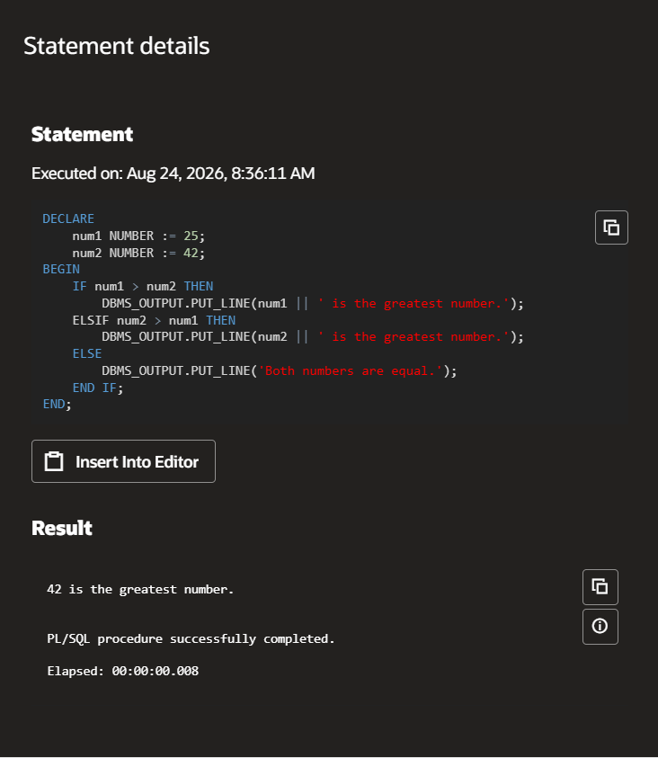
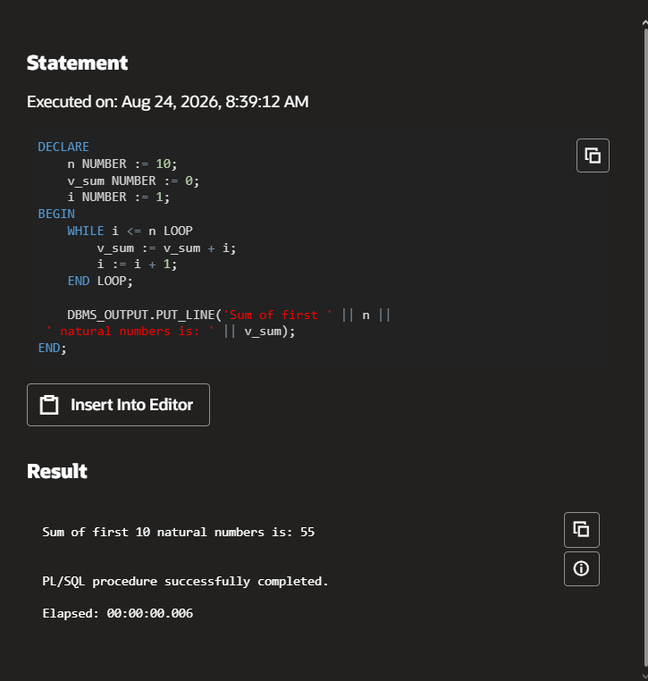
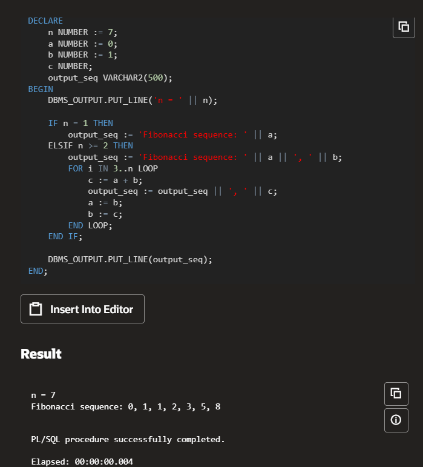
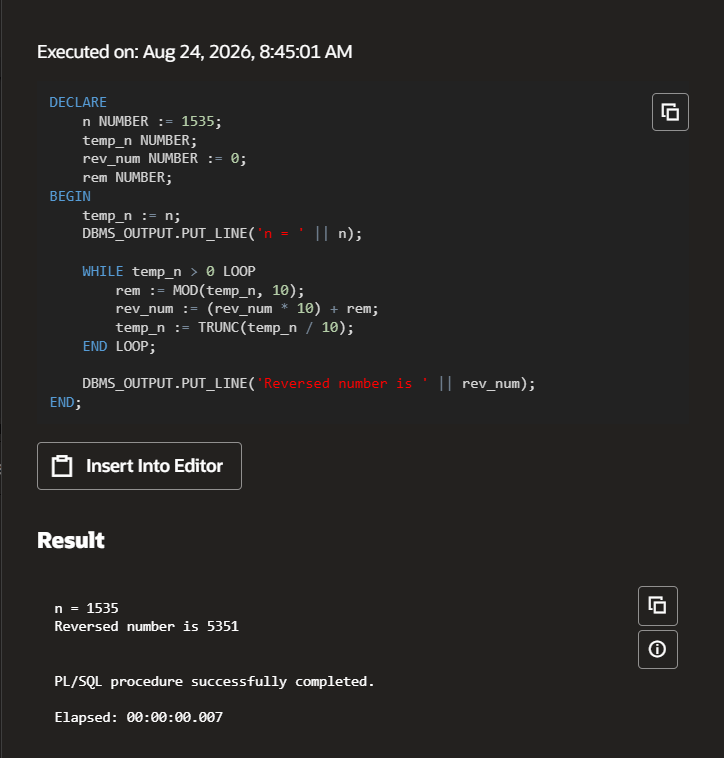
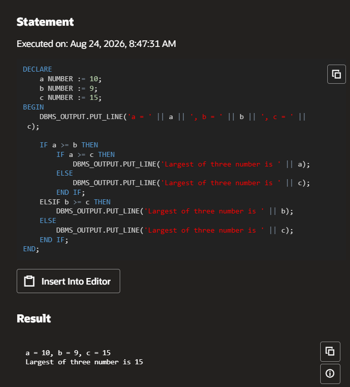

# Experiment 7: PL/SQL – Variables, Control Structures and Loops

## AIM
To write and execute simple PL/SQL programs using variables, loops, and conditional statements.


## THEORY

PL/SQL, which stands for Procedural Language extensions to the Structured Query Language (SQL). It is a combination of SQL along with the procedural features of programming languages.

**Syntax:**
```sql
DECLARE 
   <declarations section> 
BEGIN 
   <executable command(s)>
EXCEPTION 
   <exception handling> 
END;
```

### Basic Components of PL/SQL Block:
- DECLARE: Section to declare variables and constants.
- BEGIN: The execution section that contains PL/SQL statements.
- EXCEPTION: Handles errors or exceptions that occur in the program.
- END: Marks the end of the PL/SQL block.

# PL/SQL Programs – Steps and Expected Output

## 1. Write a PL/SQL program to find the Greatest of Two Numbers

### Steps:
- Declare two numeric variables and initialize them.
- Use an `IF` statement to compare the values.
- Display the greater number using `DBMS_OUTPUT.PUT_LINE`.

**Expected Output:**  
Greater number is: 80

### Code
```sql
DECLARE
    num1 NUMBER := 25;
    num2 NUMBER := 42;
BEGIN
    IF num1 > num2 THEN
        DBMS_OUTPUT.PUT_LINE(num1 || ' is the greatest number.');
    ELSIF num2 > num1 THEN
        DBMS_OUTPUT.PUT_LINE(num2 || ' is the greatest number.');
    ELSE
        DBMS_OUTPUT.PUT_LINE('Both numbers are equal.');
    END IF;
END;
```

### Output


---

## 2. Write a PL/SQL program to Calculate Sum of First N Natural Numbers

### Steps:
- Declare a variable `n` and assign a value (e.g., 10).
- Initialize a `sum` variable to 0.
- Use a `WHILE` loop to iterate from 1 to `n`, adding each number to the sum.
- Display the result using `DBMS_OUTPUT.PUT_LINE`.

**Expected Output:**  
Sum of first 10 natural numbers is: 55

### Code
```sql
DECLARE
    n NUMBER := 10;
    v_sum NUMBER := 0;
    i NUMBER := 1;
BEGIN
    WHILE i <= n LOOP
        v_sum := v_sum + i;
        i := i + 1;
    END LOOP;
    DBMS_OUTPUT.PUT_LINE('Sum of first ' || n ||
                         ' natural numbers is: ' || v_sum);
END;
```

### Output


---

## 3. Write a PL/SQL program to generate Fibonacci series

### Steps:
- Declare the variable `n` to indicate how many terms to generate.
- Initialize the first two Fibonacci numbers (0 and 1).
- Use a loop to generate the next terms using the formula `c = a + b`.
- Print each term in the series.

**Expected Output:**  
n = 7  
Fibonacci sequence: 0, 1, 1, 2, 3, 5, 8

### Code
```sql
DECLARE
    n NUMBER := 7;
    a NUMBER := 0;
    b NUMBER := 1;
    c NUMBER;
    output_seq VARCHAR2(500);
BEGIN
    DBMS_OUTPUT.PUT_LINE('n = ' || n);
    IF n = 1 THEN
        output_seq := 'Fibonacci sequence: ' || a;
    ELSIF n >= 2 THEN
        output_seq := 'Fibonacci sequence: ' || a || ', ' || b;
        FOR i IN 3..n LOOP
            c := a + b;
            output_seq := output_seq || ', ' || c;
            a := b;
            b := c;
        END LOOP;
    END IF;
    DBMS_OUTPUT.PUT_LINE(output_seq);
END;
```

### Output


---

## 4. Write a PL/SQL Program to display the number in Reverse Order

### Steps:
- Declare a variable `n` and assign a value (e.g., 1535).
- Use a loop to extract each digit using modulo and reverse the number.
- Display the reversed number.

**Expected Output:**  
n = 1535  
Reversed number is 5351

### Code
```sql
DECLARE
    n NUMBER := 1535;
    temp_n NUMBER;
    rev_num NUMBER := 0;
    rem NUMBER;
BEGIN
    temp_n := n;
    DBMS_OUTPUT.PUT_LINE('n = ' || n);
    WHILE temp_n > 0 LOOP
        rem := MOD(temp_n, 10);
        rev_num := (rev_num * 10) + rem;
        temp_n := TRUNC(temp_n / 10);
    END LOOP;
    DBMS_OUTPUT.PUT_LINE('Reversed number is ' || rev_num);
END;
```

### Output


---

## 5. Write a PL/SQL program to find the largest of three numbers

### Steps:
- Declare three numeric variables `a`, `b`, and `c`.
- Use nested `IF-ELSIF-ELSE` conditions to find the largest among the three.
- Display the largest number.

**Expected Output:**  
a = 10, b = 9, c = 15  
Largest of three number is 15

### Code
```sql
DECLARE
    a NUMBER := 10;
    b NUMBER := 9;
    c NUMBER := 15;
BEGIN
    DBMS_OUTPUT.PUT_LINE('a = ' || a || ', b = ' || b || ', c = ' || c);
    IF a >= b THEN
        IF a >= c THEN
            DBMS_OUTPUT.PUT_LINE('Largest of three number is ' || a);
        ELSE
            DBMS_OUTPUT.PUT_LINE('Largest of three number is ' || c);
        END IF;
    ELSIF b >= c THEN
        DBMS_OUTPUT.PUT_LINE('Largest of three number is ' || b);
    ELSE
        DBMS_OUTPUT.PUT_LINE('Largest of three number is ' || c);
    END IF;
END;
```

### Output


## RESULT
Thus, the PL/SQL programs using variables, conditionals, and loops were executed successfully.
